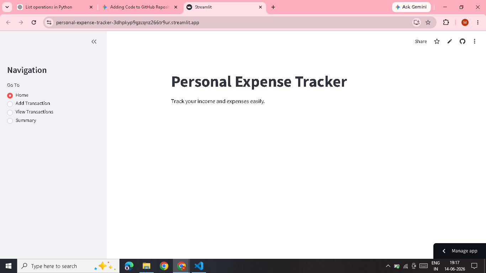
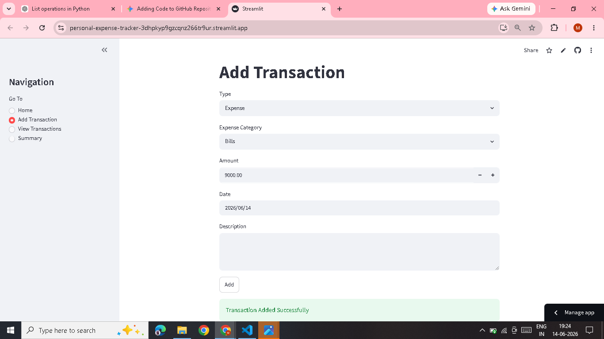
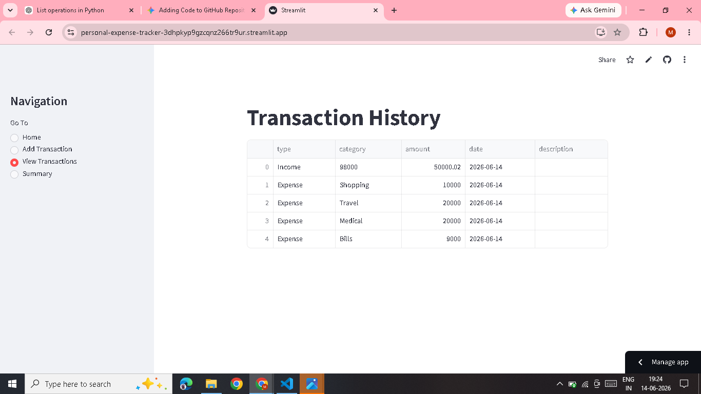
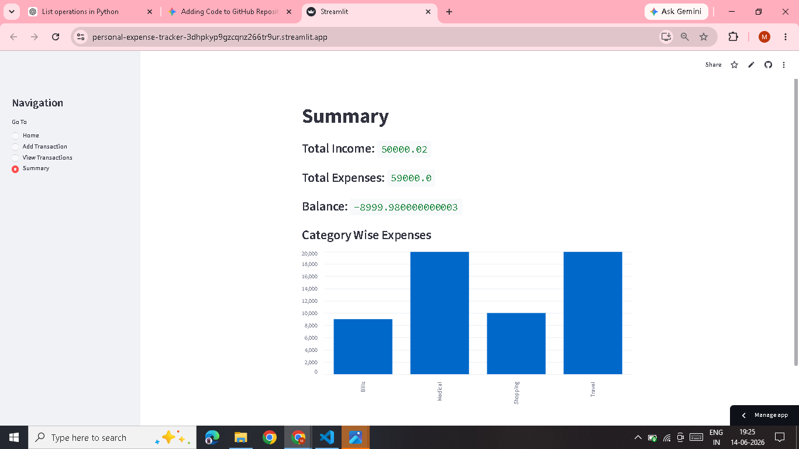

# 💰 Personal Expense Tracker

A simple and interactive web application built with **Python** and **Streamlit** to track income, manage expenses, and monitor personal financial activity.

## 📌 Project Overview

The Personal Expense Tracker is a Streamlit-based application designed to help users record and monitor their income and expenses in one place. It provides an interactive interface for adding transactions, viewing transaction history, and analyzing overall financial activity.

## ✨ Features

* ➕ Add income and expense transactions
* 📅 Record transaction dates
* 📝 Add descriptions for transactions
* 🏷️ Categorize expenses
* 📋 View transaction history
* 💰 Calculate total income
* 💸 Calculate total expenses
* 📊 View financial summary
* 📈 Analyze expenses by category
* 🖥️ Interactive Streamlit interface

## 🛠️ Technologies Used

* **Python**
* **Streamlit**
* **Pandas**

## 📂 Project Structure

```text
personal-expense-tracker/
│
├── .devcontainer/
├── screenshots/
│   ├── add.png
│   ├── home.png
│   ├── summary.png
│   └── transactions.png
│
├── .gitignore
├── README.md
├── app.py
└── requirements.txt
```

## 📸 Screenshots

### 🏠 Home



### ➕ Add Transaction



### 📋 Transactions



### 📊 Summary



## 🎥 Live Demo

🚀 **Try the application:** [Personal Expense Tracker](https://personal-expense-tracker-3dhpkyp9gzcqnz266tr9ur.streamlit.app/)

## ⚙️ Installation & Setup

### 1. Clone the repository

```bash
git clone https://github.com/MeghamalaBaipothu/personal-expense-tracker.git
```

### 2. Navigate to the project directory

```bash
cd personal-expense-tracker
```

### 3. Create a virtual environment

```bash
python -m venv .venv
```

### 4. Activate the virtual environment

**Windows:**

```bash
.venv\Scripts\activate
```

### 5. Install the required dependencies

```bash
pip install -r requirements.txt
```

### 6. Run the application

```bash
streamlit run app.py
```

The application will open in your default web browser.

## 🔄 Application Workflow

```text
Start Application
       ↓
     Home
       ↓
Add Income / Expense
       ↓
Record Transaction
       ↓
View Transactions
       ↓
View Financial Summary
       ↓
Category-wise Expense Analysis
```

## 💡 What I Learned

Through this project, I practiced:

* Building interactive applications with Streamlit
* Working with Python data structures
* Using Pandas for data handling
* Creating user-friendly application interfaces
* Managing application state
* Organizing a Python project for GitHub
* Writing project documentation using Markdown

## ⚠️ Current Limitations

* Transaction data is stored only during the application session.
* Data is not currently persisted in a database.
* Transactions may be lost when the application session is restarted.

## 🚀 Future Enhancements

* Add persistent database storage
* Add user authentication
* Add monthly and yearly expense analysis
* Add additional financial visualizations
* Add CSV/Excel export functionality
* Deploy the application online

## 👩‍💻 Author

**Baipothu Meghamala**

B.Tech — Computer Science & Engineering

[GitHub](https://github.com/MeghamalaBaipothu)
